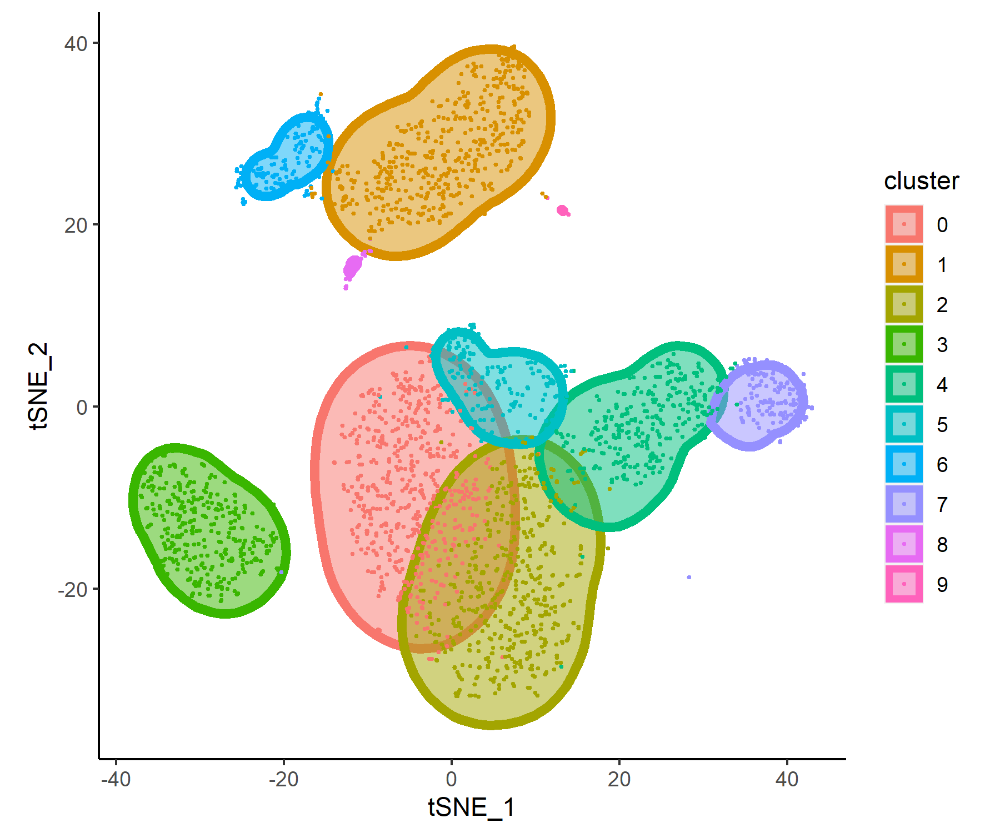

# ggunchull
A ggplot extension for drawing smooth non-convex circles around a set of points.

## Install

`ggunchull` can be installed from github.

```R
devtools::install_github("sajuukLyu/ggunchull", type = "source")
```

## Usage

Take the 10X PBMC3k dataset for example:

```R
library(Seurat)
library(ggplot2)
library(ggunchull)

data("pbmc3k")

plotData <- as.data.frame(pbmc3k[["tsne"]]@cell.embeddings)
plotData$cluster <- pbmc3k$seurat_clusters

ggplot(plotData, aes(x = tSNE_1, y = tSNE_2, fill = cluster, color = cluster)) +
  stat_unchull(alpha = 0.5, size = 2) +
  geom_point(size = 0.5) +
  theme(
    aspect.ratio = 1,
    panel.background = element_blank(),
    panel.grid = element_blank(),
    axis.line = element_line()
  )
```



The key function is `stat_unchull`, which can draw a smooth non-convex circle around every groups of cells.

It has five parameters:

- **nbin**: number of points used to shape the hull, default 100.
- **nsm**: number of points used to perform convolution, should less than **nbin**, default 10.
- **addsm**: number of additional times of convolution performed, default 1.
- **qval**: quantile of each sector, used to determine the edge of the hull, should less than 1, default 0.95.
- **sfac**: expansion size factor, larger value means bigger hull, default 1.5.

It may be useful to adjust them to make your plots look better.


